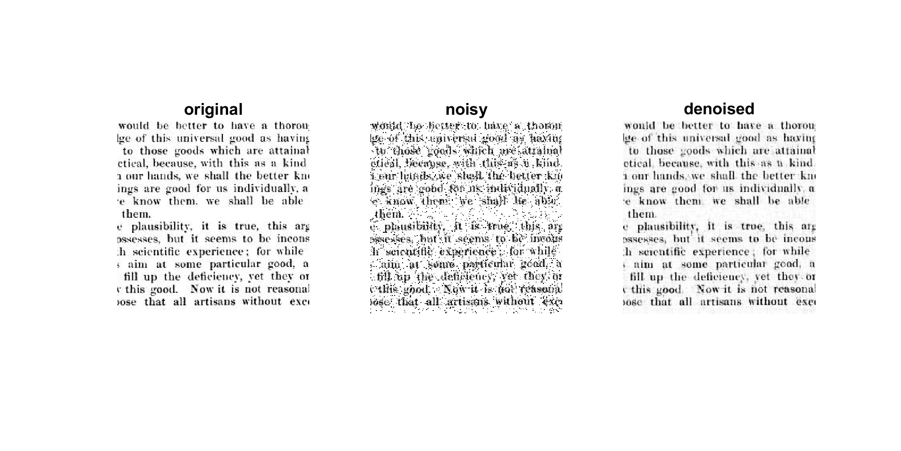

# LoBCoD
A Local Block Coordinate Descent Algorithm for the CSC Model

This is the Matlab package that implements the LoBCoD algorithm.
```
E. Zisselman, J. Sulam and M. Elad, "A Local Block Coordinate Descent Algorithm
for the Convolutional Sparse Coding Model". CVPR 2019.
``` 
\[[paper](http://openaccess.thecvf.com/content_CVPR_2019/papers/Zisselman_A_Local_Block_Coordinate_Descent_Algorithm_for_the_CSC_Model_CVPR_2019_paper.pdf)\] \[[supp](http://openaccess.thecvf.com/content_CVPR_2019/supplemental/Zisselman_A_Local_Block_CVPR_2019_supplemental.pdf)\] \[[arXiv](https://arxiv.org/abs/1811.00312)\]

## Citing LoBCoD
```
@InProceedings{Zisselman_2019_CVPR,
	author = {Zisselman, Ev and Sulam, Jeremias and Elad, Michael},
	title = {A Local Block Coordinate Descent Algorithm for the CSC Model},
	booktitle = {The IEEE Conference on Computer Vision and Pattern Recognition (CVPR)},
	month = {June},
	year = {2019}
}
```

## Installation

Download the package to a local folder (e.g. ~/LoBCoD/) by running: 
```console
git clone https://github.com/EvZissel/LoBCoD.git
```

Open Matlab and navigate to the folder (~/LoBCoD/).

## Dependencies

This code uses the following packages: 
* [vlfeat](https://github.com/vlfeat/vlfeat) - An open library of computer vision algorithms.
* [SPAMS optimization toolbox](http://spams-devel.gforge.inria.fr/) - For its implementation of the batch LARS algorithm.

For Windows
```
This code is self-contained and includes all the precompiled packages.
```

## Description
This package contains the following main modules:

| Module                       | Description 
|------------------------------|---
| LoBCoD.m                     | The main function that implements the batch LoBCoD algorithm 
| Demo.m                       | A demo script that applies the function `LoBCoD.m` on the _Fruit_ dataset 
| LoBCoD_online.m              | A function that implements the online LoBCoD algorithm 
| Demo_online.m                | A demo script that applies `LoBCoD_online.m` on a subset of _mirflickr_ dataset 
| inpainting_LoBCoD.m          | A function that implements inpainting using `LoBCoD.m`
| Demo_inpainting.m            | A demo script that applies `inpainting_LoBCoD.m`  
| Demo_Multi_Focus_Fusion.m    | A demo script for implementing multi-focus image fusion 
| Demo_Multi_Exposure_Fusion.m | A demo script for implementing multi-exposure image fusion 
| Demo_Text_Image_Denoising.m  | A demo script for implementing salt-and-pepper text image denoising 

## Examples

The training curves of the LoBCoD algorithm using `Demo.m` (trained on the _Fruit_ dataset):
<p align="center">
  
</p>

The converging objective value of the test set using `Demo_online.m` (trained on a subset of _mirflickr_ dataset): 
<p align="center">
  
</p>

Example of inpainting of the corrupted _Barbara_ image using `Demo_inpainting.m`:
<p align="center">
  
</p>

Example of multi-focus image fusion of the images _Bird_ (background and foreground in-focus) using `Demo_Multi_Focus_Fusion.m`:
<p align="center">
  
</p>

Example of multi-exposure image fusion of the images _Window_ using `Demo_Multi_Exposure_Fusion.m`:
<p align="center">
  
</p>

Example of salt-and-pepper text image denoising using `Demo_Text_Image_Denoising.m`:
<p align="center">
  
</p>